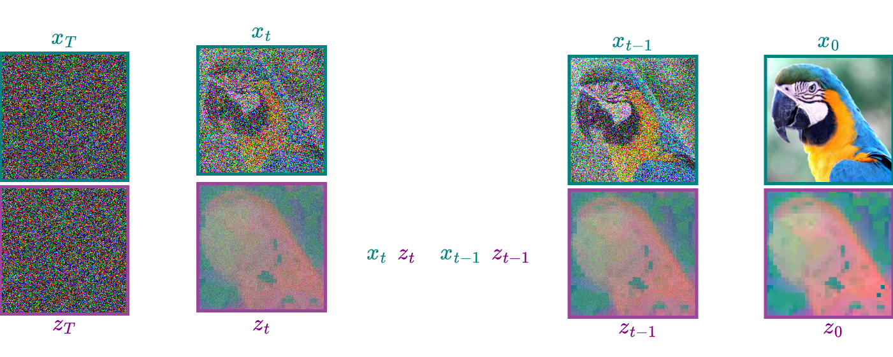

#             $\;\;\;\;\;\;\;\;$ Boosting Generative Image Modeling via $\;\;\;\;\;\;\;\;\;\;\;\;\;\;\;$ Joint Image Feature Syntheis

 $\quad\quad\quad\quad\quad\quad\;$Theodoros Kouzelis, Eystathis Karypidis, Ioannis Kakogeorgiou, $\quad\quad\quad\quad\quad\quad\quad\quad\quad\quad\quad\quad\quad$ Spyros Gidaris, Nikos Komodakis

---

### Diffusion / Flow Models (in a nutshell)

  -  Given an Image $\mathbf{x}$ and Gaussina noise $\boldsymbol{\epsilon} \sim \mathcal{N}(0,I)$

  -  Construct a time dependent noising process:
    - $\mathbf{x}_t = \alpha_t \mathbf{x} + \sigma_t \boldsymbol{\epsilon}$ 
  -  Reverse process to generate data from noise:
    - $\mathbf{x}_{t-1} = \mathbf{\tilde{x}_t} +  \boldsymbol{w}_t  \cdot \text{Network Output}$ 

$\;\;\;\;\;\;\;\;$ 

---

### Diffusion / Flow Models

$\;\;\;\;\;\;\;\;$ 

Diffusion Models for Image Generation https://learnopencv.com/image-generation-using-diffusion-models/

---

### Denoising Objective 

  -  Construct training sample $\mathbf{x}_t = \alpha_t \mathbf{x} + \sigma_t \boldsymbol{\epsilon}$ 

$\;\;\;\;\;\;\;\;$ 

---

### Denoising Objective 

  -  Give $\mathbf{x_t}$ as input to a denoising network $\epsilon_\theta$

$\;\;\;\;\;\;\;\;$ 

---

### Denoising Objective 

  -  Loss funtion $\Vert \epsilon_\theta(\mathbf{x_t})  - \epsilon \Vert_2^2$

$\;\;\;\;\;\;\;\;$ 

---

### The problem with the Denoising Objective 

  -  Loss funtion $\Vert \epsilon_\theta(\mathbf{x_t})  - \epsilon \Vert_2^2$

  -  Not capable of eliminating unnecessary details in $\mathbf{x}$

  -  Does not result in good representations

---

### DINO (in a nutshell)

-  Take different crops from an image 

-   Force representations to be similar

  -  Very strong representations

Caron et al., 2021, Emerging Properties in Self-Supervised Vision Transformers

---

### Representation Alignment 

-  Align features with the representations of powerful visual encoders. 

Yu et al., 2025, Representation Alignment for Generation: Training Diffusion Transformers Is Easier Than You Think

---

### Representation Alignment 

-   Let $h_t$ be the an intermediate feature

-   $y_* = f(x)$ (e.g. DINOv2)

-   and $h_\phi$ a simple projection layer

-   REPA loss:
    - $-\mathbb{E}[\frac{1}{N} \sum_i \text{sim}((y_*^i), h_\phi(h_t^i))]$

---

## Representation Alignment 

-  $\times17$ faster convergence

-  Better generative performance

Yu et al., 2025, Representation Alignment for Generation: Training Diffusion Transformers Is Easier Than You Think

---

## Representation Alignment for VAE Latents

-  Aligning the **VAE latents** with DINOv2 also results in better generative performance

Yao et al., 2025, Reconstruction vs. Generation: Taming Optimization Dilemma in Latent Diffusion Models

---

## ReDi: Joint image-feature Synthesis

###### 

$\;\;\;\;\;\;\;\;\;\;\;\;\;\;\;\;\;\quad\quad\quad\quad\quad\quad\quad\quad\quad\quad\quad$ 

---

## ReDi: Joint image-feature Synthesis

###### Joint Forward Process

$\;\;\;\;\;\;\;\;$ 

---

### ReDi: Joint image-feature Synthesis

###### Joint Reverse Process

$\;\;\;\;\;\;\;\;$  

---

### ReDi: Joint image-feature Synthesis

 

 

$\;\;\;\;\;\;\;\;\;\;\;\;\;\;\;\;\;\;\;\;\;\;\;\;\;$  

---

### Joint Forward Process

  -  VAE Latents:  $\mathbf{x}_t = \sqrt{\bar{\alpha}_t}\mathbf{x}_0 + \sqrt{1-\bar{\alpha}_t} \boldsymbol{\epsilon}_x$

  -  DINOv2:  $\mathbf{z}_t = \sqrt{\bar{\alpha}_t}\mathbf{z}_0 + \sqrt{1-\bar{\alpha}_t} \boldsymbol{\epsilon}_z$

$\;\;\;\;\;\;\;\;\;\;\;\;\;\;\;\;\;\;$ 

---

### Joint Denoising Objective

  -  $\mathcal{L}_{joint} = \underset{\mathbf{x}_0, \mathbf{z}_0} { \mathbb{E}} \Big[
    \Vert {\boldsymbol{\epsilon}^x_\theta}(\mathbf{x}_t,\mathbf{z}_t, t) - \boldsymbol{\epsilon}_x \Vert_2^2
    +\Vert {\boldsymbol{\epsilon}^z_\theta}(\mathbf{x}_t,\mathbf{z}_t, t) - \boldsymbol{\epsilon}_z \Vert_2^2 \Big]$

$\;\;\;\;\;\;\;\;\;\;\;\;\;\;\;\;\;\;\;\;\;\;\;\;$ 

---

### Fusing the two modelities in a single input sequence

-  Merged Tokens

-  Separete Tokens

---

### Fusing the two modelities in a single input sequence

-   Modality-specific **embedding** matrices:
    - $\mathbf{W}_{\text{emp}}^x \in \mathbb{R}^{C_x \times C_d}$
    - $\mathbf{W}_{\text{emp}}^z \in \mathbb{R}^{C_z \times C_d}$
-   Modality-specific **projection** matrices:
    - $\mathbf{W}_{\text{dec}}^x \in \mathbb{R}^{C_d \times C_x}$
    - $\mathbf{W}_{\text{dec}}^z \in \mathbb{R}^{C_d \times C_x}$

---

### Merged Tokens

 The tokens are summed channel-wise:
-   $\mathbf{h}_t = \mathbf{x}_t \mathbf{W}_{\text{emb}}^x + \mathbf{z}_t \mathbf{W}_{\text{emb}}^z \in \mathbb{R}^{L \times C_d}$

-   The transformer processes $h_t$ to produce $o_t$

-   $\boldsymbol{\epsilon}^x_\theta = \mathbf{o}_t  \mathbf{W}_{\text{dec}}^x, \quad  
\boldsymbol{\epsilon}^z_\theta = \mathbf{o}_t \mathbf{W}_{\text{dec}}^z.$

---

### Merged Tokens

-    Early fusion.

-    Maintains computational efficiency, as the token **count remains unchanged**.

---

### Separete Tokens

 Tokens are concatenated along the sequence dimension:
-   $\mathbf{h}_t = [\mathbf{x}_t \mathbf{W}_{\text{emb}}^x \,, \, \mathbf{z}_t \mathbf{W}_{\text{emb}}^z] \in \mathbb{R}^{2L \times C_d},$

-    The transformer outputs separate representations $\mathbf{o}_t = [\mathbf{o}_t^x \,, \, \mathbf{o}_t^z]$

-   $\boldsymbol{\epsilon}^x_\theta = \mathbf{o}^x_t  \mathbf{W}_{\text{dec}}^x, \quad  
\boldsymbol{\epsilon}^z_\theta = \mathbf{o}^z_t \mathbf{W}_{\text{dec}}^z.$

---

### Separete Tokens

-   Preserves modality-specific information.
-    **Increased computation** due to increased token count ($\times 2$).

---

### Dimensionality-Reduced Visual Representation

-   The channels of $\texttt{DINOv2}$ significantly exceeds that of $\texttt{VAE latent}$

---

### Dimensionality-Reduced Visual Representation

-   Sample $N$ features from training set and calculate a PCA projection matrix $P_z$ 

---

### Dimensionality-Reduced Visual Representation

-   Project to principal subspace: $z_{pca} = z \times P_z$

---
## Redi Pipeline

$\;\;\;\;\;\;\;\;\;\;$ 

---

## Represenation Guidance

-    Inspired by Classifier-Free Guidance.

-    During inference we modify the posterior distribution to: $\hat{p}_\theta(\mathbf{x}_t, \mathbf{z}_t) \propto p_\theta(\mathbf{x}_t) p( \mathbf{z}_t \vert \mathbf{x}_t)^{w_r}$

- Samples are pushed toward higher likelihood of the conditional distribution $p_\theta(\mathbf{z}_t | \mathbf{x}_t)$

---

## Represenation Guidance

-    Taking the log derivative yields the guided score function:
$$
\begin{align}
    \nabla_{\!\mathbf{x}_t} \text{log} \; \hat{p}_\theta(\mathbf{x}_t, \mathbf{z}_t)=&
        \nabla_{\!\mathbf{x}_t} \text{log} \; \big[p_\theta(\mathbf{x}_t) p( \mathbf{z}_t \vert \mathbf{x}_t)^{w_r}
        \big] \\

\end{align}
$$

---

## Represenation Guidance

-    Taking the log derivative yields the guided score function:
$$
\begin{align}
    \nabla_{\!\mathbf{x}_t} \text{log} \; \hat{p}_\theta(\mathbf{x}_t, \mathbf{z}_t)=&
        \nabla_{\!\mathbf{x}_t} \text{log} \; \big[p_\theta(\mathbf{x}_t) p( \mathbf{z}_t \vert \mathbf{x}_t)^{w_r}
        \big] \\

    =&
        \nabla_{\!\mathbf{x}_t} \text{log} \;p_\theta(\mathbf{x}_t)+
        w_r\big(
    \nabla_{\!\mathbf{x}_t} \text{log} \;p_\theta(\mathbf{z}_t \vert \mathbf{x}_t)
        \big) \\

\end{align}
$$

---

## Represenation Guidance

-    Taking the log derivative yields the guided score function:
$$
\begin{align}
    \nabla_{\!\mathbf{x}_t} \text{log} \; \hat{p}_\theta(\mathbf{x}_t, \mathbf{z}_t)=&
        \nabla_{\!\mathbf{x}_t} \text{log} \; \big[p_\theta(\mathbf{x}_t) p( \mathbf{z}_t \vert \mathbf{x}_t)^{w_r}
        \big] \\
    \nabla_{\!\mathbf{x}_t} \text{log} \; \hat{p}_\theta(\mathbf{x}_t, \mathbf{z}_t)=&
        \nabla_{\!\mathbf{x}_t} \text{log} \;p_\theta(\mathbf{x}_t)+
        w_r\big(
    \nabla_{\!\mathbf{x}_t} \text{log} \;p_\theta(\mathbf{z}_t \vert \mathbf{x}_t)
        \big) \\
        =& \nabla_{\!\mathbf{x}_t} \text{log} \;p_\theta(\mathbf{x}_t)+
        w_r\big(
    \nabla_{\!\mathbf{x}_t} \text{log} \;p_\theta(\mathbf{x}_t, \mathbf{z}_t)-
    \nabla_{\!\mathbf{x}_t} \text{log} \;p_\theta(\mathbf{x}_t)
        \big).
\end{align}
$$

---

## Represenation Guidance

$$
\begin{align}
    \nabla_{\!\mathbf{x}_t} \text{log} \; \hat{p}_\theta(\mathbf{x}_t, \mathbf{z}_t)
        =& \nabla_{\!\mathbf{x}_t} \text{log} \;p_\theta(\mathbf{x}_t)+
        w_r\big(
    \nabla_{\!\mathbf{x}_t} \text{log} \;p_\theta(\mathbf{x}_t, \mathbf{z}_t)-
    \nabla_{\!\mathbf{x}_t} \text{log} \;p_\theta(\mathbf{x}_t)
        \big).
\end{align}
$$

-    From the equivalance between denoisers and scores we have:
$\boldsymbol{\hat{\epsilon}}_\theta(\mathbf{x}_t, \mathbf{z}_t, t) = \boldsymbol{\epsilon}_\theta(\mathbf{x}_t, t) + w_r\left(\boldsymbol{\epsilon}_\theta(\mathbf{x}_t, \mathbf{z}_t, t) - \boldsymbol{\epsilon}_\theta(\mathbf{x}_t, t)\right).$

---

## Represenation Guidance

$\boldsymbol{\hat{\epsilon}}_\theta(\mathbf{x}_t, \mathbf{z}_t, t) = \boldsymbol{\epsilon}_\theta(\mathbf{x}_t, t) + w_r\left(\boldsymbol{\epsilon}_\theta(\mathbf{x}_t, \mathbf{z}_t, t) - \boldsymbol{\epsilon}_\theta(\mathbf{x}_t, t)\right).$

- We train both $\boldsymbol{e_\theta}(\mathbf{x}_t, \mathbf{z}_t, t)$ and $\boldsymbol{e_\theta}(\mathbf{x}_t, t)$ jointly. 

- With probability $p_{drop}=0.2$:
    - Zero out $\mathbf{z}_t$ (setting $\boldsymbol{\epsilon}_\theta(\mathbf{x}_t, t) = \boldsymbol{\epsilon}_\theta(\mathbf{x}_t, \mathbf{0}, t)$)
    
    - Disable the visual representation denoising loss. 

---

# Experimental Results 🔬 📊

---

## Ablation
### Dimentionality reduction 

- Intermediate subspace ($r=8$)
- Retains sufficient expressivity to guide generation 
- Does not dominate model capacity.

---

## Ablation

###### Merged Tokens vs. Separate Tokens.

---

###### Merged Tokens vs. Separate Tokens.

Merged Tokens

- ~Same training and infernce compute

---

###### Merged Tokens vs. Separate Tokens.

Merged Tokens

- ~Same training and infernce compute

Separete Tokens

- ~$\times 2$ training and infernce compute
- Slightly better performance

---

## Main benchmark
###### Conditional Generation

- $\sim \times 6$ faster than $\texttt{REPA}$

- Converged performance :
    - $\texttt{REPA}: \;\;$ 5.9 FID

    - $\texttt{ReDi}: \;\;$ 3.3 FID

---

## Main benchmark
###### Conditional Generation w/ CFG

---

# Selected Samples

$\;\;\;\;$ 

---

### Unconditional Generation 

- $\text{Representation Guidance} \; (\texttt{RG})$ is very usefull for unconditional generation

- $\texttt{ReDi}$ significantly closes the gap between conditional and unconditional generation

---

# Representation Guidance

$\;\;\;\;\;\;\;\;\;\;\;\;\;\;\;\;\;\;$ 

---

# Possible Future Research Directions 

 - Multiple Representations (e.g. $\texttt{DINOv2}$ and $\texttt{CLIP}$)

 - Different dimentionality reduction approach

 - Leverege the generated representations

---

